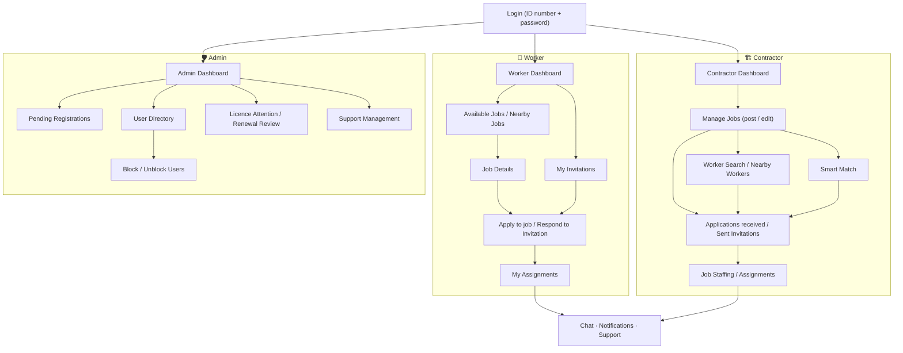
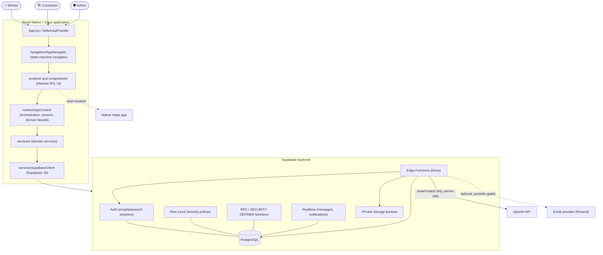
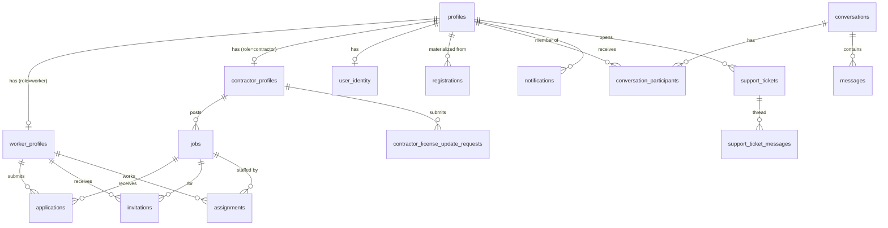

# 🏗️ BuildUp

**A smart construction-workforce management and matching platform that connects contractors and workers, with an admin authority that governs registration, identity and account status.**

BuildUp is a full-stack mobile application: a **React Native + Expo** client with a **Hebrew, right-to-left (RTL)** interface, backed entirely by **Supabase** (PostgreSQL, Auth, Row Level Security, RPC functions, Realtime, private Storage and Edge Functions). All application data is persisted server-side — there is no local mock layer.

<p>
  
  
  
  
  
  
  
  
</p>

---

## 📑 Table of Contents

- [Project Overview](#-project-overview)
- [Problem & Solution](#-problem--solution)
- [User Roles](#-user-roles)
- [Key Features](#-key-features)
- [User Flow](#-user-flow)
- [Smart Match](#-smart-match)
- [Maps & Location](#-maps--location)
- [System Architecture](#-system-architecture)
- [Backend Architecture](#-backend-architecture)
- [Database & Domain Model](#-database--domain-model)
- [Project Structure](#-project-structure)
- [Edge Functions](#-edge-functions)
- [Private Storage](#-private-storage)
- [Realtime: Chat & Notifications](#-realtime-chat--notifications)
- [Security & Privacy](#-security--privacy)
- [Blocked-Account Lifecycle](#-blocked-account-lifecycle)
- [Installation](#-installation)
- [Environment Configuration](#-environment-configuration)
- [Running the App](#-running-the-app)
- [Database Migrations](#-database-migrations)
- [Testing & Quality](#-testing--quality)
- [Demo / Exam Data](#-demo--exam-data)
- [Limitations & Design Boundaries](#-limitations--design-boundaries)
- [Screenshots](#-screenshots)
- [Authors](#-authors)

---

## 🏗️ Project Overview

BuildUp is a marketplace and workflow tool for the Israeli construction sector. It brings three groups into one system:

| Role | Purpose |
| --- | --- |
| **👷 Worker** | Maintains a professional profile, discovers jobs, applies, accepts invitations, and manages assignments. |
| **🏗️ Contractor** | Publishes and manages jobs, reviews applications, invites workers, staffs jobs, and uses Smart Match to rank candidates. |
| **🛡️ Admin** | Approves registrations, inspects protected identity data, reviews contractor licences, handles support, and blocks / unblocks accounts. |

The technical foundation:

- **React Native + Expo (SDK 54)** client, written in **TypeScript** under `strict` mode.
- **Hebrew RTL UI** across every screen.
- **Supabase** as the single backend: **PostgreSQL** with **Row Level Security**, **RPC / SECURITY DEFINER** functions for all privileged writes, **Realtime** for chat and notifications, **private Storage** buckets for documents and images, and **Edge Functions** (Deno) for authentication bridging, admin operations and Smart Match.
- A **role-based experience** — the navigator renders a different shell, tab set and screen stack per role, and the server re-verifies role and status on every privileged action.

---

## 🎯 Problem & Solution

Staffing a construction job well means reconciling many moving parts at once:

- finding workers of the **right trade** quickly, or at least the right **profession category**;
- matching **skills** and required **certifications**;
- respecting **availability** (available now, or from a future date relative to the job start);
- staying within a **compensation** range (hourly or daily);
- keeping **travel distance** reasonable;
- accounting for **prior working history** between a contractor and a worker;
- running **job applications**, **contractor invitations**, **staffing capacity** and **assignments** without double-booking;
- keeping a contractor's **licence** current and verified;
- and keeping **communication** and **support** in one auditable place.

These are normally spread across phone calls, spreadsheets and messaging apps. **BuildUp unifies them into a single role-aware workflow** on top of one persistent database: profiles and taxonomy, job posting with an optional exact worksite pin, an application / invitation / assignment lifecycle with real capacity accounting, a hybrid deterministic + AI ranking engine, direct chat, persistent notifications, a support thread, and an admin console for registration, identity, licence and account governance.

The scope is deliberately bounded: BuildUp organizes and ranks — it does not process payments, and it does not perform authoritative government verification of IDs or contractor licences (those steps remain a manual admin review).

---

## 👥 User Roles

### 👷 Worker

- Professional profile: full name, city of residence, one or more **professions**, **profession category**, **skills**, **certifications** (each with an optional certificate document), **years of experience**, **bio**, and **hourly / daily rates**.
- **Availability management** — "available now" or "available from" a date.
- **Available Jobs** and **Nearby Jobs**, with distance filters computed from the worker's residence city.
- **My Applications** — submit, track status, withdraw, and re-apply where the rules allow.
- **Invitations** received from contractors — accept or decline.
- **My Assignments** — active and completed work, with cancel / complete transitions.
- **Favorite contractors**.
- **Chat** with contractors, **notifications**, and **support tickets**.
- **Avatar** upload and **self-service reveal of the worker's own national ID**.

### 🏗️ Contractor

- Company / contractor profile: company name, contractor registration number, city, **areas of operation**, **project types**, **bio**, and a **verified licence** (classification text, document, validity dates, verification status).
- **Job creation and editing**: title, description, professions and category, required certifications, free-text requirements, city, typed worksite address, **optional exact map pin**, **worksite images**, schedule, rates, and number of workers needed.
- **My Jobs** management, plus **close / reopen / delete** for clean jobs.
- **Applications received** — accept or reject, with drilldown to the worker's profile.
- **Sent Invitations** — invite workers, cancel pending invitations.
- **Job Staffing** — live capacity progress (slots filled vs. needed).
- **Worker Search** and **Nearby Workers** (distance from the contractor's residence city).
- **Favorite workers**.
- **Smart Match** — AI-assisted ranked candidates for an eligible job.
- **Chat** with workers, **notifications**, and **support tickets**.
- **Licence renewal workflow** — submit an update request (new document / classification / dates) for admin review.

### 🛡️ Admin

- **User directory** with search and per-user detail.
- **Registration queue** — review pending registrations and **approve** or **reject** (with reason); a rejected registration can be sent back to review.
- **Registration detail** — role, full name, submitted professional / company data, and the uploaded ID document.
- **Secure identity inspection** — decrypt one applicant's or user's national ID on demand, server-side only.
- **Contractor licence attention** — a queue of licences that are pending review, expired, or due for a periodic re-check.
- **Licence renewal review** — approve or reject a contractor's licence update request; stamp a periodic verification; request a renewal.
- **Support management** — respond to tickets and open / close them.
- **Block / unblock** users (a status change, never deletion).
- **Admin notifications** — new pending registration, new support ticket, licence attention.

---

## ✨ Key Features

| Feature | Summary |
| --- | --- |
| **National ID + password auth** | The login UX is "Israeli ID number + password"; a server-side Edge Function bridges it to Supabase email/password auth. The raw ID is never stored — only a keyed HMAC (lookup) and an AES-GCM ciphertext (controlled reveal). |
| **Registration & admin approval** | Sign-up creates a `registrations` record; a live Worker / Contractor profile is materialized only after an admin approves it, in one transaction. |
| **Worker & contractor profiles** | Normalized taxonomy (professions, categories, areas, project types, cities) with role-specific child tables for skills, certifications, preferred areas, etc. |
| **Jobs** | Rich job posts with professions, required certifications, requirements, schedule, rates, worksite images and an optional exact map pin. |
| **Applications / Invitations / Assignments** | A full staffing lifecycle: worker-initiated applications and contractor-initiated invitations both converge on an `assignment`, created atomically under a per-job lock. |
| **Staffing capacity** | `occupied_slot_count` (active + completed) vs. `workers_needed`; accepting a candidate re-checks capacity under the same lock, and a job auto-closes when full. |
| **Favorites** | Contractor ↔ worker favorites (there are no job favorites). |
| **Smart Match AI** | Hybrid deterministic + bounded-AI ranking of eligible workers for a contractor's job (see below). |
| **Maps & location** | Optional exact worksite pin, worksite map preview, "open in maps", and distance-based discovery. |
| **Nearby Jobs / Nearby Workers** | City-centroid distance calculations for both directions. |
| **Realtime chat** | Direct 1:1 worker ↔ contractor conversations, persisted in PostgreSQL, delivered live via Supabase Realtime, with per-participant read state. |
| **Persistent notifications** | Notification rows written in-transaction with the event that caused them; delivered live; deep-link to the relevant screen. |
| **Support tickets** | A per-user ticket with an append-only message thread and admin replies / status changes. |
| **Contractor licence workflow** | Verified licence fields on the contractor, plus a review pipeline for updates. |
| **Admin management** | Registration, identity, licence and account-status governance. |
| **Blocked-account lifecycle** | Blocking removes a user from *new* marketplace activity while preserving all history; unblocking restores eligibility from live data. |
| **Private file storage** | Five private buckets; database rows hold object paths; files are served via short-lived signed URLs. |

---

## 🔄 User Flow

The main paths through the app for each role. Every step maps to a screen that already exists in `screens/`.



---

## 🧠 Smart Match

Smart Match answers one question for a contractor: **"for this specific job of mine, which approved and available workers fit best, and why?"**

### Flow

```
Contractor picks an eligible job (open for applications)
        │
        ▼
Mobile app → smartMatchService.getSmartMatches({ jobId })
        │
        ▼
Supabase Edge Function  "smart-match"  (verify_jwt = true)
        │  1. authenticate caller from JWT (auth.uid())
        │  2. re-check live profile: approved contractor
        │  3. load the job; confirm the caller owns it
        │  4. confirm the job is open for applications
        │  5. load approved workers who are available for new work
        │  6. deterministic professional scoring + ordering (bounded set)
        │  7. AI semantic pass over an allowlisted, tokenized payload
        │  8. merge, re-validate, rank
        ▼
Ranked results (match %, level, factor breakdown, strengths, concerns,
                optional AI summary, real distance in km) → contractor UI
```

### Scoring (high level)

The **deterministic model is the core**. It scores each candidate on data-backed dimensions and produces the headline percentage and the per-factor breakdown:

- **profession / profession-category fit** (exact trade match, same category, or neither — with a hard ceiling when the trade does not match),
- **experience** (years),
- **skills & required certifications** coverage,
- **availability** (available now, or available before the job start date),
- **compensation** (worker rate vs. job budget, hourly or daily),
- **geographic distance** (server-side Haversine),
- **shared / prior working history** with this contractor.

The **AI pass adds a small, bounded semantic signal** plus short Hebrew `strengths`, `concerns` and a one-sentence summary. The model can never set the final percentage on its own — its contribution is capped at a small fraction of the total, and its text reasons are merged *after* the deterministic, data-backed ones.

### Eligibility and privacy rules

- Only **approved** workers with a real worker profile are considered.
- A worker who has set themselves **unavailable** is **not** newly recommended, even if they have past history with the contractor. Historical relationships stay reachable through the normal app screens.
- **Distance** uses the job's **exact map pin** when the contractor set one, and the **job city centroid** as fallback. Workers are represented by their **residence city centroid** — exact worker home coordinates are never stored or used.
- The payload sent to the AI provider is built from a **server-side privacy allowlist** of professional fields only, wrapped in **opaque per-request tokens** (`c1..cN`). No UUID, name, phone, email, national ID, document path, licence, avatar, chat or notification data leaves the function.
- All user free-text is passed to the model as untrusted **data**; the prompt forbids following instructions embedded in it, and the output is schema- and allowlist-validated regardless of what the model returns.
- There is **no fake fallback**: if the AI provider is unavailable or returns an unusable result after one repair retry, the function returns an error and the app shows its Hebrew error state. It never fabricates a ranking.
- The **OpenAI API key is a server-side Edge Function secret only** and is never bundled with the client.

---

## 🗺️ Maps & Location

BuildUp uses [`react-native-maps`](https://github.com/react-native-maps/react-native-maps) and `expo-location`, and runs under Expo Go **without a Google Maps API key**.

### Job location

- **Job city** — required; chosen from the bundled Israeli-cities dataset.
- **Typed worksite address** — optional, **display information only**; it is never parsed for distance.
- **Optional exact map pin** — the contractor can drop a precise `lat` / `lon` for the worksite.
- **Worksite map preview** on the job details screen, plus an "open in maps" action.

### Distance model

| Context | From | To |
| --- | --- | --- |
| **Worker → Nearby Jobs** | worker residence city centroid | job exact pin, else job city centroid |
| **Contractor → Nearby Workers** | contractor residence city centroid | worker residence city centroid |
| **Smart Match** | worker residence city centroid | job exact pin, else job city centroid |

Notes:

- Exact **worker home coordinates are never stored**; worker residence GPS is not required.
- Distances resolve to `undefined` ("unknown") when an endpoint cannot be resolved — never a fabricated `0`.
- The city-centroid coordinates come from a static dataset in `data/israelCities.ts`.

---

## 🏛️ System Architecture



The client talks to Supabase **only** — there is no custom Express / REST server and no controller layer. Reads go through the Supabase JS client under RLS; every privileged write goes through an RPC or an Edge Function.

---

## 🗄️ Backend Architecture

| Component | Role in BuildUp |
| --- | --- |
| **Supabase Auth** | Email/password sessions. The app's "ID + password" login is translated to auth credentials **server-side** by the `login-by-id` Edge Function. Password recovery uses Supabase Auth's native recovery **OTP code** flow (no deep link). |
| **PostgreSQL** | The single source of truth: normalized taxonomy, profiles, jobs, the staffing lifecycle, chat, notifications, support, identity and licence data. |
| **Row Level Security** | Enabled on every application table. Clients get a **SELECT-scoped** surface (e.g. own rows, conversation members, jobs a user may view); direct `INSERT` / `UPDATE` / `DELETE` grants are revoked on the sensitive tables. |
| **RPC functions** | All state transitions (`respond_to_application`, `respond_to_invitation`, assignment cancel / complete, `send_message`, `mark_conversation_read`, support RPCs, `create_job` / `update_job`, licence RPCs, admin `admin_*` functions). Most are **SECURITY DEFINER**, re-derive the caller from `auth.uid()`, enforce the allowed transition, touch a fixed column set, and write any resulting notification **in the same transaction**. |
| **Edge Functions (Deno)** | Anything that needs a secret or privileged key: auth bridging, unauthenticated registration + one-shot upload URLs, admin approve / reject / block / licence review, controlled ID decryption, hard job delete + Storage cleanup, Smart Match, and the best-effort notification-email mirror. |
| **Realtime** | `public.messages` and `public.notifications` are in the `supabase_realtime` publication; the client opens authenticated `postgres_changes` INSERT subscriptions, filtered per-subscriber by the same RLS. |
| **Private Storage** | Five private buckets with their own access policies; see [Private Storage](#-private-storage). |
| **Migrations** | The entire schema, RLS, Storage policies, RPCs and lifecycle logic are versioned SQL files in `supabase/migrations/` (`001` … `048`). |

The React Native app never holds a service-role key, an HMAC pepper, an encryption key, or any provider API key. It carries only the **public** Supabase URL and publishable key.

---

## 🗃️ Database & Domain Model

Selected core entities (not an exhaustive column list):

| Entity | Notes |
| --- | --- |
| `profiles` | One row per user: `role`, `status`, contact fields. Role/status here are server-side truth. |
| `user_identity` | Keyed HMAC of the national ID (lookup / dedup) + AES-GCM ciphertext (controlled reveal). Column-level SELECT locked down. |
| `worker_profiles` / `contractor_profiles` | Role-specific profile data, plus child tables: `worker_professions`, `worker_skills`, `worker_certifications`, `worker_preferred_areas`, `contractor_areas`, `contractor_project_types`. |
| `registrations` / `registration_status_events` | Pre-approval snapshot and an immutable status audit trail. |
| `jobs` | Owned by a contractor; child tables `job_professions`, `job_required_certifications`, `job_requirements`, `job_worksite_images`; optional `lat` / `lon`. |
| `applications` | Worker → job. Status lifecycle with withdraw / re-apply rules. |
| `invitations` | Contractor → worker for a job. Accept / decline / cancel. |
| `assignments` | The staffing result (`source` = application or invitation); `active` / `completed` / `cancelled`. |
| `conversations` / `conversation_participants` / `messages` | Direct 1:1 worker ↔ contractor chat; `last_read_at` per participant drives unread counts. |
| `notifications` | Per-user, in-transaction with their cause; idempotent via a `dedupe_key`. |
| `support_tickets` / `support_ticket_messages` | A ticket with an append-only thread; admin replies and status changes. |
| `contractor_license_update_requests` | Contractor-initiated licence changes awaiting admin review. |
| `contractor_favorite_workers` / `worker_favorite_contractors` | The two favorites relations. |



---

## 📁 Project Structure

```
buildup-final-project/
├── App.tsx                     App root (providers + navigator)
├── app.json                    Expo config (plugins, permissions)
├── package.json                Scripts and dependencies
├── tsconfig.json               TypeScript (strict) config
├── .env.example                Public runtime config template (placeholders only)
│
├── components/                 Reusable RTL UI components
├── config/
│   └── env.ts                  Central access to EXPO_PUBLIC_* config
├── context/
│   └── AppContext.tsx          Orchestration, session, domain facade
├── data/
│   ├── professions.ts          Profession / category taxonomy
│   ├── areas.ts                Operating-area taxonomy
│   └── israelCities.ts         City list + centroid coordinates
├── hooks/
│   └── useSelfIdNumber.ts      Own-national-ID reveal hook
├── navigation/
│   └── AppNavigator.tsx        Role-aware state-machine navigator
├── screens/                    Full screens per role and workflow
├── services/                   Supabase / domain communication layer
├── theme/
│   └── colors.ts               Design tokens (colors, spacing, radius, type)
├── types/
│   ├── index.ts                Shared domain types
│   ├── auth.ts                 Session / login result types
│   └── database.types.ts       Generated Supabase schema types
├── utils/                      Shared helpers (distance, normalize, …)
│
└── supabase/
    ├── config.toml             Supabase CLI + Edge Function config
    ├── functions/              Edge Functions (Deno) + _shared helpers
    └── migrations/             Versioned SQL: schema, RLS, RPC, lifecycle
```

| Path | Purpose |
| --- | --- |
| `components/` | Reusable application UI components (cards, pickers, sheets, chat bubbles, Smart Match widgets), all RTL. |
| `config/` | Single accessor for the public Expo runtime configuration. |
| `context/` | `AppContext` — session bootstrap, the live domain collections, realtime wiring, and the mutation facade every screen calls. |
| `data/` | Static production reference data: profession taxonomy, operating areas, and the Israeli-cities dataset with centroid coordinates. |
| `hooks/` | Reusable React hooks. |
| `navigation/` | A custom state-machine navigator: auth / status flows, three role shells with bottom tabs and drilldown stacks, and notification deep-linking. |
| `screens/` | Every full screen, grouped by role (Worker / Contractor / Admin) and by shared flows (chat, notifications, support, settings, auth). |
| `services/` | Data-in / data-out modules that talk to Supabase (auth, profiles, jobs, applications, invitations, assignments, chat, notifications, favorites, support, licence, storage, Smart Match, Edge Function client). |
| `theme/` | Design tokens shared across the UI. |
| `types/` | Shared TypeScript domain interfaces, auth/session types, and the generated database types. |
| `utils/` | Framework-free helpers: Haversine / distance rules, string normalization, password policy, document opening, scroll memory, contact helpers. |
| `supabase/functions/` | Server-side Edge Functions and their shared email helpers. |
| `supabase/migrations/` | The authoritative database schema, RLS policies, Storage policies, RPC functions and lifecycle logic, as ordered SQL migrations. |

---

## 🚀 Edge Functions

All Edge Functions run on Deno. `verify_jwt` and per-function notes come from `supabase/config.toml` and each function's header.

| Edge Function | `verify_jwt` | Purpose |
| --- | --- | --- |
| `register` | false | Unauthenticated worker / contractor sign-up. Stores **no** raw ID, password or email — only an HMAC and an AES-GCM ciphertext of the ID. Verifies the pre-uploaded ID document, then persists the `registrations` row. |
| `register-upload-url` | false | Reserves a registration id + ID-document path and mints a short-lived one-shot signed **upload** token, so an unauthenticated signer can upload their ID document without the service-role key ever reaching the client. |
| `login-by-id` | false | The only bridge from "Israeli ID + password" to Supabase email/password auth. Normalizes and HMACs the ID, looks it up, and either returns tokens or a `pending` / `rejected` status. Every auth failure returns an identical response (no account enumeration). |
| `approve-registration` | true | Admin-only (re-checked against live `profiles`). Materializes the profile + role tables + `user_identity` in one transaction and flips the registration. |
| `reject-registration` | true | Admin-only. Rejects a registration (with reason), or reverts a rejected registration back to review. Never materializes a profile. |
| `admin-reveal-id` | true | Admin-only. Decrypts **one** applicant's or user's national ID for verification. Ciphertext never returned; plaintext never logged. |
| `admin-user-action` | true | Admin-only single entry point for block / unblock, set contractor registration number, and grant / revoke admin permissions. Writes run in `admin_*` SECURITY DEFINER SQL functions. |
| `review-license-update` | true | Admin-only contractor-licence review / periodic verify / request-renewal. Transactional write + contractor notification in a SECURITY DEFINER function. |
| `delete-job` | true | Hard-deletes one **clean** job (no applications / invitations / assignments), then best-effort cleans its private worksite images. Caller must be the approved owner or a live admin. |
| `reveal-my-id` | true | Self-only counterpart of `admin-reveal-id`: an authenticated user sees **their own** national ID. Identity is chosen solely from `auth.uid()`. |
| `smart-match` | true | The hybrid deterministic + bounded-AI ranking engine for a contractor's eligible job (see [Smart Match](#-smart-match)). |
| `notify-email` | n/a (shared-secret webhook) | Best-effort transactional-email mirror for a small allowlist of high-value notification types. Fires from a database webhook on `notifications` INSERT. Inert until its provider secret and webhook secret are configured; it never writes back to the database. |

---

## 🔐 Private Storage

Five **private** buckets (`public = false`):

| Bucket | Contents |
| --- | --- |
| `avatars` | Profile / company avatars. Readable by any signed-in user; writable only in the owner's folder. |
| `id-documents` | Registration ID documents. No client writes (service-role only, via `register`); readable by the owning registration's user or an admin. |
| `contractor-licenses` | Contractor licence documents. Readable by the owner or an admin; kept indefinitely. |
| `worker-certificates` | Worker certificate scans. Readable by the worker, an admin, or a contractor with a relationship to that worker. |
| `worksite-images` | Job worksite photos. Readable by anyone who may view the job; managed by the job's contractor. |

Rules:

- Database rows store the **object path**, not a URL.
- Files are displayed / downloaded through **short-lived signed URLs** minted server-side.
- Access is enforced by **Storage RLS policies** keyed on the object's folder (owner id or job id) and helper functions such as `can_view_job` / `can_view_profile`.
- **No permanent public URL** is ever issued for a private document.

---

## 🔔 Realtime: Chat & Notifications

### Chat

- Direct **1:1 worker ↔ contractor** conversations only (self-chat and same-role chat are rejected server-side).
- Conversations and messages are **persisted in PostgreSQL**. A conversation is created only via `get_or_create_direct_conversation` (race-safe on a deterministic `pair_key`); messages are written only via `send_message` (server sets the sender, trims, rejects empty / oversized bodies, requires an approved participant).
- **Supabase Realtime** delivers new messages live over one authenticated INSERT subscription; RLS (`is_conversation_member`) is the per-subscriber boundary.
- **Read / unread** state is the `conversation_participants.last_read_at` timestamp, moved only through `mark_conversation_read`; unread counts are computed server-side.

### Notifications

- Every notification is a **persistent row**, written **in the same transaction** as the event that caused it, and made idempotent by a `dedupe_key`.
- `public.notifications` is in the Realtime publication; the client opens one authenticated INSERT subscription for the signed-in user.
- Rows carry **read / unread** state (`is_read`, the only column a client may update).
- Tapping a notification **deep-links** to the relevant screen (e.g. a `new_message` notification opens that conversation).

> **In-app notifications are fully implemented.** OS-level remote **push notifications are not part of the Expo Go configuration** used for this project and are not implemented.

---

## 🛡️ Security & Privacy

- **Row Level Security** on every application table; clients hold a read-scoped surface and no direct write grants on sensitive tables.
- **Server-side authorization** for every privileged action: the caller is derived from `auth.uid()` and re-checked against **live** `profiles` (`role`, `status`) — never from a JWT claim or a request-body field.
- **Blocked-account guards** in the database paths that would otherwise let a blocked user (or a job whose owner is blocked) re-enter new marketplace discovery or create a new assignment.
- **Private Storage** with signed-URL access only; folder-keyed Storage policies.
- **No service-role key in client code.** The app bundle contains only the public Supabase URL + publishable key.
- **National ID protection**: normalized then **HMAC-SHA256** (keyed lookup / dedup); a separate **AES-256-GCM** ciphertext supports controlled reveal. Column-level SELECT on the ciphertext is revoked from client roles.
- **Controlled ID reveal**: `reveal-my-id` (self, identity from `auth.uid()` only) and `admin-reveal-id` (live approved admin, one subject at a time). Ciphertext is never returned; plaintext is never logged.
- **Smart Match privacy allowlist**: the AI provider receives only allowlisted professional fields wrapped in opaque per-request tokens; free-text is treated as untrusted data and the output is schema-validated.
- **OpenAI is called server-side only**, with the key held as an Edge Function secret.
- **Environment separation**: `EXPO_PUBLIC_*` values are public by design; every real secret lives **only** as a Supabase Edge Function secret.
- **Exact worker home coordinates are never stored** — residence location is city-level.

**Secrets are never committed and never bundled with the client.** The following are **names only** — their values live solely as Supabase Edge Function secrets: `SUPABASE_SERVICE_ROLE_KEY`, `ID_HMAC_PEPPER`, `ID_ENC_KEY`, `OPENAI_API_KEY`, `RESEND_API_KEY`, `NOTIFY_EMAIL_SECRET`.

---

## 🚧 Blocked-Account Lifecycle

Blocking is an **account status change, never data deletion**. Every historical row — jobs, applications, invitations, assignments, messages, favorites, notifications — is left exactly as it is.

**When a worker is blocked:**

- removed from new marketplace discovery and from **Nearby Workers**;
- removed from **Smart Match** candidate sets;
- cannot create new marketplace actions (new application, new invitation acceptance, new message);
- historical records remain; existing chat history stays readable, but new messaging is prevented.

**When a contractor is blocked:**

- their jobs stop being available for **new applications**;
- new marketplace activity is prevented server-side;
- historical jobs and assignments remain; historical chat stays readable;
- pending new actions against their jobs are guarded in the database, not just hidden in the UI.

**When unblocked:**

- eligibility is restored from **current live data**;
- no historical data needs to be recreated.

---

## ⚙️ Installation

BuildUp is primarily intended to be run and demonstrated using **Expo Go on a physical Android or iPhone device**.

1. **Clone the repository**

   ```bash
   git clone https://github.com/soaadhujerat-prog/buildup-final-project.git
   ```

2. **Enter the project directory**

   ```bash
   cd buildup-final-project
   ```

3. **Install dependencies**

   ```bash
   npm install
   ```

4. **Configure `.env`** — copy `.env.example` to `.env` and fill in your Supabase project values (see [Environment Configuration](#-environment-configuration)).

5. **Start Expo**

   ```bash
   npx expo start
   ```

6. **Open the project in Expo Go** on a physical Android or iPhone device — scan the QR code shown in the terminal (Android: scan from inside the Expo Go app; iPhone: scan with the Camera app). The phone and the computer must be on the same network.

Requirements: a recent LTS release of **Node.js** (as expected by Expo SDK 54) and **npm**. No global Expo CLI install is required — the project uses `npx expo`.

---

## 🔧 Environment Configuration

Copy the template and fill in your Supabase project values:

```bash
cp .env.example .env
```

`.env` (git-ignored) contains **only public runtime configuration**:

```bash
EXPO_PUBLIC_SUPABASE_URL=your_supabase_url
EXPO_PUBLIC_SUPABASE_PUBLISHABLE_KEY=your_supabase_publishable_key
```

- `EXPO_PUBLIC_SUPABASE_URL` — `https://<project-ref>.supabase.co`
- `EXPO_PUBLIC_SUPABASE_PUBLISHABLE_KEY` — the publishable key (`sb_publishable_...`); public by design, access is governed by RLS on the server.

**Server-side secrets are configured separately as Supabase Edge Function secrets and are never part of the React Native bundle.** By category (names only): the service-role key (privileged Edge Functions), the ID HMAC pepper and ID encryption key (identity hashing / reveal), the OpenAI key (Smart Match), and the email provider key + notify webhook secret (transactional email). Never place real values in `.env.example` or in source.

---

## 📱 Running the App

```bash
npx expo start
```

**BuildUp is primarily intended to be run and demonstrated using Expo Go on a physical mobile device.** After `npx expo start`, scan the QR code from the terminal with **Expo Go** on a physical Android or iPhone device to launch the app. The app connects directly to the Supabase project named in your `.env`.

An Android emulator or iOS simulator can optionally be used as a development alternative (`npm run android` / `npm run ios`), but the physical-device Expo Go flow is the recommended way to run and present the project.

### Additional Scripts

These are convenience / development commands and are **not** required to run the project:

| Script | Action |
| --- | --- |
| `npm start` | `expo start` |
| `npm run android` / `npm run ios` / `npm run web` | Start with a target platform (emulator / simulator / web) |
| `npm run typecheck` | `tsc --noEmit` (strict) |
| `npm run gen:types` | Regenerate `types/database.types.ts` from the Supabase schema |

---

## 🧬 Database Migrations

The database is evolved through ordered SQL files in `supabase/migrations/`, from `001` to the current **`048`**. They cover, among other areas:

- extensions, enums and reference taxonomy;
- `profiles`, identity, admin permissions, worker / contractor profile tables;
- registrations and the ID-encryption / document pipeline;
- jobs, worksite images, close / reopen / delete, and worksite coordinates;
- the staffing lifecycle: applications, invitations, assignments, capacity, withdraw / re-apply;
- RLS policies, function-execution hardening and security-review hardening;
- Storage buckets and access policies;
- RPC functions and triggers;
- in-app notifications (in-transaction, idempotent) and notification realtime;
- chat: persistence, security, realtime, read state, and message notifications;
- support tickets backend;
- contractor licence operations and review;
- the blocked-user lifecycle hardening pass;
- and location / maps support.

Migrations are applied to the Supabase project with the Supabase CLI (`supabase db push`).

---

## 🧪 Testing & Quality

The project's automated quality gate is **TypeScript static validation**:

```bash
npm run typecheck
```

`tsconfig.json` extends the Expo base config with `strict: true`. The `supabase/functions/` directory (Deno runtime) is excluded from the app typecheck.

Beyond the typecheck, the application has been exercised against the **real Supabase backend** through a manual regression pass covering:

- role / session bootstrap and status gating (pending / rejected / blocked);
- registration → admin approval → live profile materialization;
- the application / invitation / assignment lifecycle and staffing capacity;
- Smart Match eligibility, ranking and the no-fallback error path;
- RLS and server-side authorization on privileged writes;
- the notification lifecycle (in-transaction creation, realtime delivery, deep-linking);
- maps / location and the distance model;
- private Storage access via signed URLs.

> There is no Jest / unit-test suite and no ESLint configuration in this repository; the statements above describe the checks that exist.

---

## 🧾 Demo / Exam Data

The development Supabase backend contains an **exam-ready dataset** that demonstrates the key Worker, Contractor and Admin flows end to end. Credentials are provided separately for the evaluation and are intentionally **not** included in this repository.

---

## 📌 Limitations & Design Boundaries

These are deliberate deployment / design choices, not gaps:

- **OS-level remote push notifications are not enabled** in the Expo Go configuration used here. In-app persistent notifications (with realtime delivery and deep-linking) are fully implemented.
- **Residence location is city-level by design.** Exact worker home coordinates are never stored; distance uses city centroids (and the job's exact pin when present).
- **Government verification of national IDs and contractor licences is a manual admin review.** No authorized external verification API is integrated, so BuildUp provides the secure inspection tooling and the review workflow rather than an automated legal check.
- **Transactional email depends on server-side configuration.** The `notify-email` function and its templates exist, but email is sent only once the email-provider secret and the database webhook (with its shared secret) are configured on the Supabase project. Until then it is an inert no-op and nothing is faked.
- **BuildUp does not process payments.** Compensation is captured and compared for matching purposes only.

---

## 📱 Screenshots

Application screenshots will be added here to showcase the main Worker, Contractor, Smart Match, and Admin flows.

---

## 👩‍💻 Authors

**BuildUp** was developed as an academic final-year project.

- **Soaad Hujerat**
- **Ghina Yazbak**
